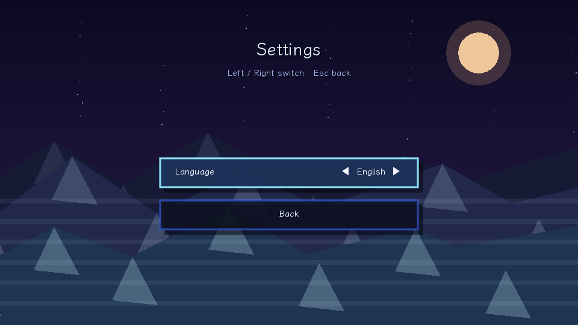

# Shadow Duet

[English](README.md) | [中文](README.zh-CN.md)

**Shadow Duet** is a playable 2D time-echo puzzle platformer prototype made with **LÖVE / Love2D**.

You cooperate with your **self from 4 seconds ago**. Your shadow can press pads, open doors, block lasers, push crates, and help the present player reach the exit.

---

## Screenshots

### Main Menu


### Mission Board


### Shadow Cooperation


### Crate Puzzle


### Settings & Pause
| Settings | Pause |
|---|---|
|  |  |

---

## Features

- 4-second delayed shadow replay
- Player movement with acceleration, friction, coyote time, jump buffering, and variable jump height
- Shadow can press pads, block lasers, and push crates
- Pressure pads react to player, shadow, and crates
- Doors, lasers, crates, and goal triggers
- 12 short PRD-aligned tutorial/prototype levels
- Mission-board level select
- Chinese-English language toggle in Settings
- Pause menu
- Local save data
- Fast restart with `R`
- Hold `Tab` to preview the recent 4-second route

---

## Run

Install Love2D 11.x, then run:

```bash
cd shadow-duet-love2d
love .
```

Or run it directly from another directory:

```bash
love /path/to/shadow-duet-love2d
```

---

## Controls

| Action | Key |
|---|---|
| Move | `A/D` or arrow keys |
| Jump | `Space` / `W` / `Up` |
| Restart | `R` |
| Pause | `Esc` / `P` |
| Show trail | Hold `Tab` |
| Confirm | `Enter` |
| Fullscreen | `F11` |

---

## Core Loop

1. Step on a pressure pad.
2. Leave the pad and the door closes.
3. Four seconds later, the shadow repeats your previous action.
4. Pass through the door while the shadow holds the pad.
5. Later levels add crates, lasers, and combined timing puzzles.

---

## Project Structure

```text
shadow-duet-love2d/
├── conf.lua
├── main.lua
├── levels.lua
├── README.md
├── README.zh-CN.md
├── assets/
│   └── fonts/
│       └── LXGWWenKai-Regular.ttf
└── docs/
    └── screenshots/
```

- `conf.lua` - Love2D window and app config
- `main.lua` - Game loop, physics, recorder, menus, rendering
- `levels.lua` - Level data
- `assets/fonts/` - Chinese-capable font
- `docs/screenshots/` - README screenshots

---

## Status

This is a playable prototype/demo focused on validating the core mechanic: cooperating with your past self.

Good next steps: Web build, sound effects, level balancing, and production-quality art assets.
