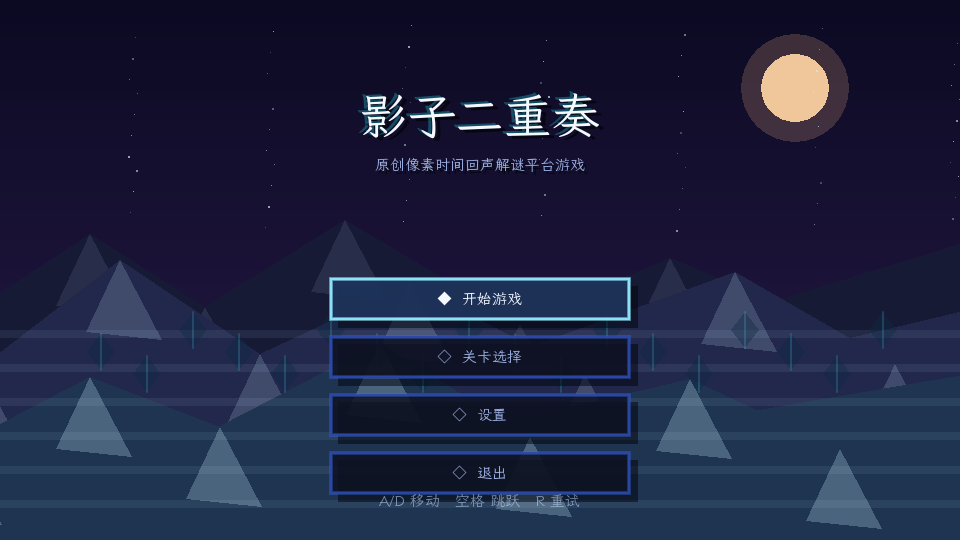
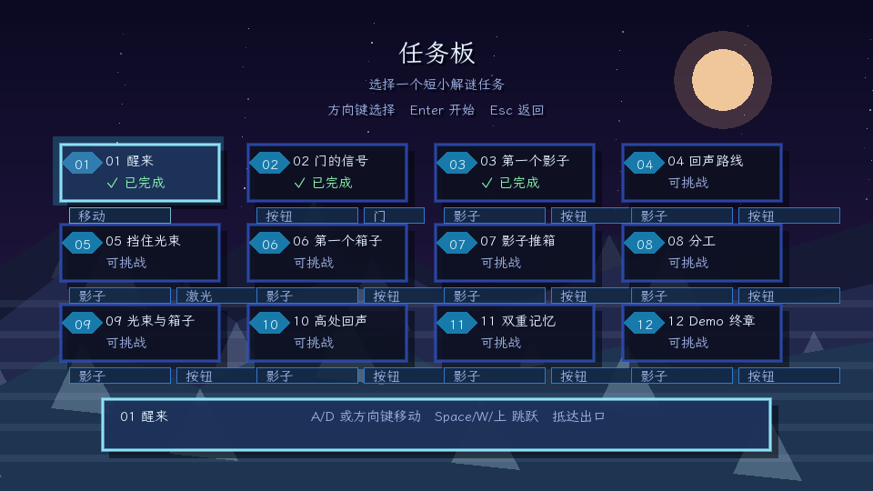
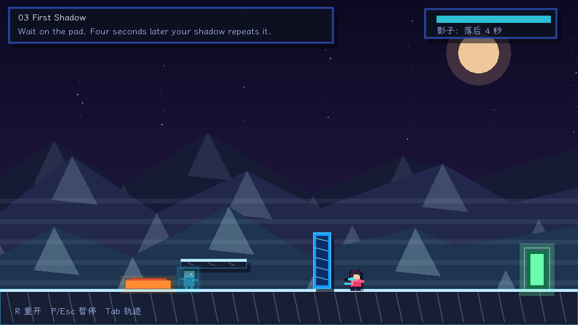
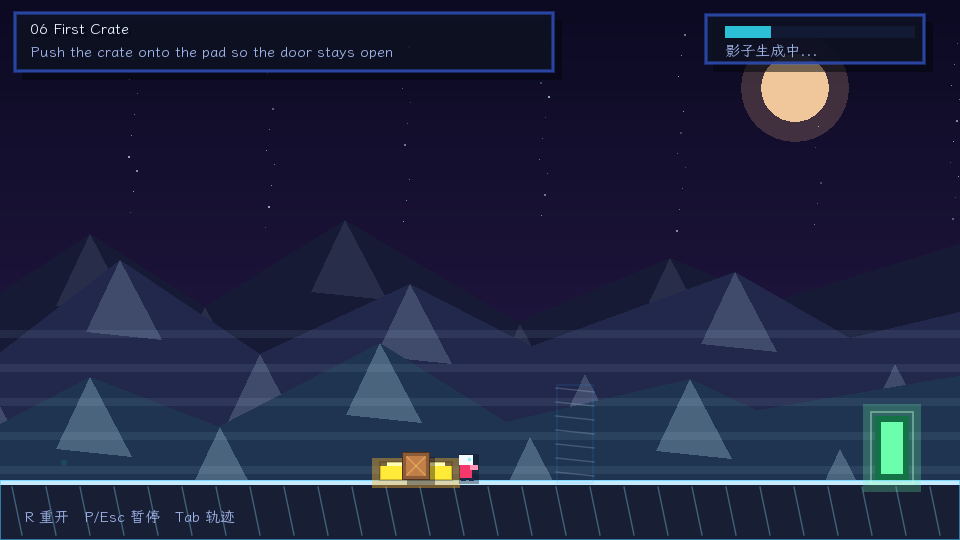
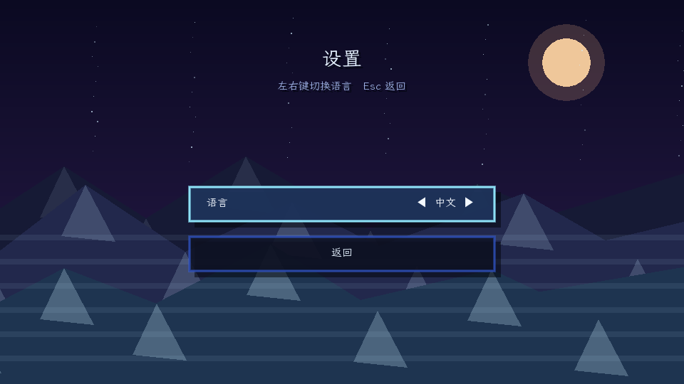
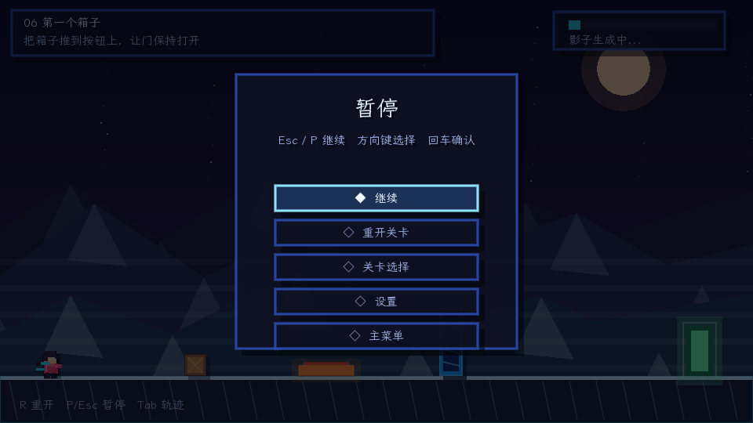

# 影子二重奏

[English](README.md) | [中文](README.zh-CN.md)

在线游玩：https://awsl233777.github.io/shadow-duet-love2d/

**影子二重奏** 是一个使用 **LÖVE / Love2D** 制作的 2D 横版时间协作解谜平台游戏原型。

玩家需要和 **4 秒前的自己** 协作：让影子踩按钮、开门、挡激光、推箱子，帮助现在的自己抵达终点。

---

## 截图

### 主菜单


### 任务板


### 影子协作


### 箱子机关


### 设置与暂停
| 设置 | 暂停 |
|---|---|
|  |  |

---

## 功能

- 4 秒延迟影子回放
- 玩家移动、跳跃、土狼时间、跳跃缓存、可变跳高
- 影子可踩按钮、挡激光、推箱子
- 玩家、影子、箱子都能触发压力按钮
- 门、激光、箱子、终点机关
- 12 个短关卡，按 PRD 教学节奏推进
- 任务板式选关
- 设置页中英文切换
- 暂停菜单
- 本地存档
- `R` 快速重开
- 按住 `Tab` 显示最近 4 秒轨迹

---

## 运行

安装 Love2D 11.x 后运行：

```bash
cd shadow-duet-love2d
love .
```

也可以直接指定目录：

```bash
love /path/to/shadow-duet-love2d
```

---

## 操作

| 操作 | 按键 |
|---|---|
| 移动 | `A/D` 或方向键 |
| 跳跃 | `空格` / `W` / `上` |
| 重开 | `R` |
| 暂停 | `Esc` / `P` |
| 显示轨迹 | 按住 `Tab` |
| 菜单确认 | `回车` |
| 全屏 | `F11` |

---

## 核心玩法

1. 先让玩家踩上按钮。
2. 玩家离开后，门会关闭。
3. 4 秒后，影子重复刚才的动作。
4. 影子踩住按钮时，玩家穿过门。
5. 后续关卡会加入箱子、激光和多机关组合。

---

## 项目结构

```text
shadow-duet-love2d/
├── conf.lua
├── main.lua
├── levels.lua
├── README.md
├── README.zh-CN.md
├── assets/
│   └── fonts/
│       └── LXGWWenKai-Regular.ttf
└── docs/
    └── screenshots/
```

- `conf.lua`：Love2D 窗口与应用配置
- `main.lua`：游戏循环、物理、录像回放、菜单、渲染
- `levels.lua`：关卡数据
- `assets/fonts/`：裁剪后的中文字体
- `docs/screenshots/`：README 截图

---

## 当前状态

这是一个可玩的 Prototype / Demo，用于验证“和几秒前的自己合作”的核心机制。

下一步适合继续打磨 Web 版、音效、关卡平衡和正式美术资源。
